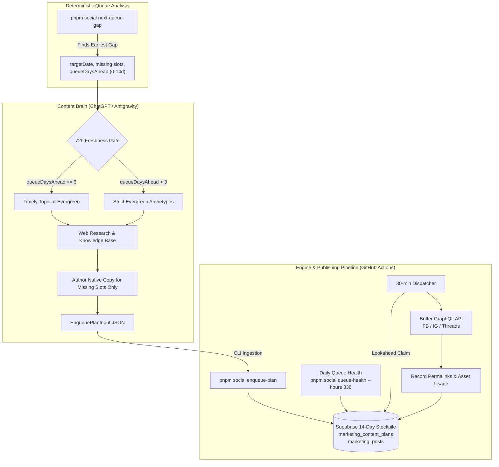

# Paper English Social Engine — Queue-Aware Scheduler Setup Guide

This document explains how to operate the queue-aware content conveyor belt using ChatGPT Scheduled Tasks (or on-demand executor agents like Antigravity) as the autonomous research and planning brain, backed by deterministic queue-gap discovery and Buffer GraphQL publishing infrastructure.

---

## 1. Architectural Overview: The 14-Day Stockpile Conveyor Belt



The repository contains **zero runtime LLM calls**. The AI brain handles planning and research; the repository provides deterministic queue discovery, database management, asset tracking, safety switches, and Buffer publishing infrastructure.

---

## 2. Queue Discovery: `pnpm social next-queue-gap`

To prevent AI hallucination of dates or mental-math scheduling errors, the engine provides a deterministic queue-gap calculator:

```bash
pnpm social next-queue-gap
```

Output:
```json
{
  "targetDate": "2026-09-05",
  "missing": [
    { "platform": "threads", "slot": 1 },
    { "platform": "threads", "slot": 2 },
    { "platform": "instagram", "slot": 1 }
  ],
  "queueDaysAhead": 3,
  "recommendedCopyLengthMode": "short"
}
```

### How `next-queue-gap` Works:
1. **Zone-Aware Iteration**: Checks calendar days from `today` (Day 0) up to 14 days out (`queueDaysAhead = 0..13`) in `Asia/Taipei`.
2. **Platform Constraints**: Evaluates platform weekly targets, preferred days, and daily caps:
   - **Threads**: 2 posts/day every day (slots 1 and 2).
   - **Facebook**: 4 posts/week (Tue, Thu, Sat, Sun; slot 1).
   - **Instagram**: 3 posts/week (Mon, Wed, Fri; slot 1).
3. **Day-0 Expiration Protection**: For `today`, slots whose publishing windows have already passed are considered expired, preventing scheduling posts into the past.
4. **Immediate Stop on Earliest Gap**: Returns the very first date that has any missing slots.
5. **Full Queue Notification**: When the entire 14-day horizon is fully booked, returns:
   ```json
   {
     "targetDate": null,
     "missing": [],
     "queueDaysAhead": 14,
     "message": "Queue fully stocked across 14-day horizon"
   }
   ```

Operators or automated scripts can run this command repeatedly. Each run fills one date, feeding the conveyor belt up to two weeks ahead.

---

## 3. Core Policy: 72h Timely-Topic Freshness Rule

When writing content for `targetDate`:
- **`queueDaysAhead <= 3` (within 72 hours)**: Eligible for the `timely_topic` archetype (breaking Taiwan education news, 108 課綱 announcements, exam trends, seasonal parent discussions) or evergreen archetypes.
- **`queueDaysAhead > 3` (beyond 72 hours)**: **Strictly forbidden** to choose `timely_topic`. Must use evergreen archetypes (`pain_point`, `educational_value`, `product_proof`, `conversion_offer`) so that content scheduled up to 14 days in advance does not rot or become obsolete before publication.

---

## 4. Deterministic Ingestion via `enqueue-plan`

The safest, production-hardened pattern is:
1. **AI Brain generates the JSON plan**: Following [docs/CHATGPT_SCHEDULER_PROMPT.md](file:///c:/IDEA/eng-poster/docs/CHATGPT_SCHEDULER_PROMPT.md), the AI outputs a structured JSON payload conforming to `EnqueuePlanInput` for `targetDate`.
2. **Deterministic Validation Gate**: The engine's CLI (`pnpm social enqueue-plan`) sits in front of the database to enforce:
   - Platform character limits and mode bounds (Threads: short 5–100, long 150–350; FB: short 10–150, long 250–800; IG: short 30–180, long 180–400)
   - Asset mode validation (`text_only`, `image_post`, `link_preview`)
   - Copy length strategy (`copyLengthMode: 'short' | 'long'`) and quality gates (forbidding AI boilerplate intros/conclusions)
   - Mandatory source URLs on all factual/researched claims
   - Media selection with cooldowns (`visualConceptCooldownDays = 7`)
   - Platform weekly and daily caps
   - Deterministic slot timing and collision avoidance
   - UTM parameter generation and clean first-comment attribution
   - SHA-256 content hashing and idempotent deduplication
3. **Safe Queue Insertion**: Only fully-validated plans and posts are written into Supabase.

### CLI Usage:
```bash
pnpm social enqueue-plan --input payload.json
```

Or inline:
```bash
pnpm social enqueue-plan --input '{"planDate":"2026-09-05","archetype":"pain_point","topic":"背單字挫折","posts":[{"platform":"threads","copyLengthMode":"short","assetMode":"text_only","copyText":"孩子背了就忘...","claimManifest":[]}]}'
```

---

## 5. ChatGPT Scheduled Task Setup

1. Open **ChatGPT** (with custom GPT or ChatGPT Scheduled Tasks enabled).
2. Create a new Scheduled Task named `Paper English Social Conveyor Planner`.
3. Set schedule recurrence: **Every day at 06:00 AM (Asia/Taipei)** (or trigger on-demand).
4. Attach or provide access to the repository's `knowledge/` directory:
   - Core guides: `audience.md`, `brand.md`, `claims.md`, `product.md`, `voice.md`.
   - All example files: `knowledge/examples/**` (`knowledge/examples/*.md`, used together as reference benchmarks across all platforms).
5. Copy the entire contents of [docs/CHATGPT_SCHEDULER_PROMPT.md](file:///c:/IDEA/eng-poster/docs/CHATGPT_SCHEDULER_PROMPT.md) into the task instructions.
6. Execution: The task reads `next-queue-gap`, targets the missing slots, and outputs the validated plan JSON.

---

## 6. Supabase Table Specifications

### Table: `public.marketing_content_plans`
| Column | Type | Description |
|---|---|---|
| `id` | `uuid` | Primary key (`gen_random_uuid()`) |
| `plan_date` | `date` | Target execution date (e.g. `2026-09-05`) |
| `archetype` | `text` | One of `pain_point`, `educational_value`, `product_proof`, `timely_topic`, `conversion_offer` |
| `topic` | `text` | Editorial topic title |
| `audience` | `text` | Target audience (e.g. `Taiwan parents grade 5-8`) |
| `campaign_slug` | `text` | Campaign slug (e.g. `always-on`) |
| `research_snapshot` | `jsonb` | `{ "query": "...", "sources": [...], "factualNotes": [...] }` |
| `provenance` | `jsonb` | Metadata including source, prompt version, `queueDaysAhead`, timestamp |

### Table: `public.marketing_posts`
| Column | Type | Description |
|---|---|---|
| `id` | `uuid` | Primary key (`gen_random_uuid()`) |
| `content_plan_id` | `uuid` | Foreign key referencing `marketing_content_plans(id)` |
| `platform` | `text` | `'facebook' \| 'instagram' \| 'threads'` |
| `asset_mode` | `text` | `'text_only' \| 'image_post' \| 'link_preview'` |
| `copy_length_mode` | `text` | `'short' \| 'long'` |
| `copy_text` | `text` | Authored post text |
| `destination_url` | `text` | UTM URL or `NULL` if CTA is none |
| `media_asset_id` | `uuid` | Foreign key referencing `marketing_assets(id)` (optional) |
| `scheduled_for` | `timestamptz`| Scheduled publish timestamp (ISO8601 with timezone) |
| `status` | `text` | Lifecycle: `'scheduled'` &rarr; `'claimed'` &rarr; `'provider_scheduled'` &rarr; `'published'` |
| `provider_scheduled_at` | `timestamptz` | Timestamp when Buffer accepted the future schedule |
| `provider_status` | `text` | Status reported by Buffer (`'scheduled'`, `'sent'`, `'failed'`) |
| `idempotency_key` | `text` | `${plan_date}:${platform}:${slot_number}` (unique constraint) |
| `content_hash` | `text` | `sha256(copy_text)` |
| `claim_manifest` | `jsonb` | Array of `{ "text": "...", "kind": "...", "sourceUrls": [...] }` |

### Asset Strategy & Attribution Rules:
- **Facebook**: Either `link_preview` or `image_post` (not mixed).
  - `image_post`: Media attached. Post body is clean (no raw URLs). `destination_url` is automatically sent to Buffer as the first comment (`metadata.facebook.firstComment`).
  - `link_preview`: No attached media. Destination URL is included in the main post text. No duplicate first comment.
  - `text_only`: Rare. No media, no URL.
- **Threads**: Intentionally select `text_only`, `image_post`, or `link_preview`.
  - `image_post`: Media attached. Main post copy has no raw URL. When `destination_url` exists, it is automatically published as a 2nd-item self-reply thread via Buffer's official `metadata.threads.thread`.
  - `link_preview`: No attached media. Destination URL is in the main post. No duplicate reply.
  - `text_only`: Pure copy. No media, no URL.
- **Instagram**: Strictly `image_post` only.
  - Media asset is mandatory. Caption has no raw URL. When `destination_url` exists, it is sent to Buffer as the first comment (`metadata.instagram.firstComment`).

---

## 7. 336h Queue Health Monitoring

To verify the full 14-day stockpile horizon (336 hours) without authoring anything:

```bash
pnpm social queue-health --hours 336
```

The GitHub Actions workflow [.github/workflows/queue-health.yml](file:///c:/IDEA/eng-poster/.github/workflows/queue-health.yml) automatically runs daily to report on 336 hours of upcoming posts.
