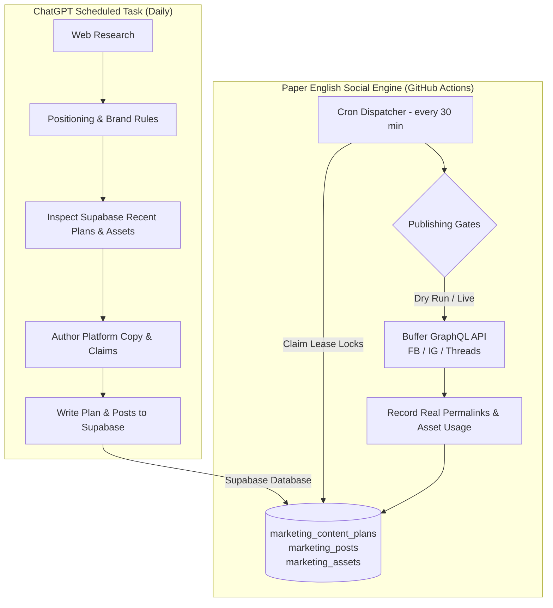

# ChatGPT Scheduler Setup Guide

This document explains how to set up ChatGPT as the autonomous planning and research brain for the Paper English social marketing engine.

---

## 1. Architectural Overview



The repository contains **zero runtime LLM calls**. ChatGPT handles planning and research; the repository provides hardened database management, asset tracking, safety switches, and Buffer publishing infrastructure.

---

## 2. Recommended Workflow: Deterministic Ingestion via `enqueue-plan`

The safest, production-hardened pattern is:
1. **ChatGPT generates the JSON plan**: Following [docs/CHATGPT_SCHEDULER_PROMPT.md](file:///c:/IDEA/eng-poster/docs/CHATGPT_SCHEDULER_PROMPT.md), ChatGPT outputs a structured JSON payload conforming to `EnqueuePlanInput`.
2. **Deterministic Validation Gate**: The engine's CLI (`pnpm social enqueue-plan`) sits in front of the database to enforce:
   - Platform character limits (Threads: 500, Instagram: 2200, Facebook: 63206)
   - Asset mode validation (`text_only`, `image_post`, `link_preview`)
   - Mandatory source URLs on all factual/researched claims
   - Media selection with cooldowns (`visualConceptCooldownDays = 7`)
   - Platform weekly and daily caps
   - Deterministic slot timing and collision avoidance
   - UTM parameter generation and clean first-comment attribution
   - SHA-256 content hashing and idempotent deduplication
3. **Safe Queue Insertion**: Only fully-validated plans and posts are written into Supabase.

### CLI Usage:
```bash
pnpm social enqueue-plan --input payload.json
```

Or inline:
```bash
pnpm social enqueue-plan --input '{"planDate":"2026-09-02","archetype":"pain_point","topic":"背單字挫折","posts":[{"platform":"threads","assetMode":"text_only","copyText":"孩子背了就忘...","claimManifest":[]}]}'
```

---

## 3. ChatGPT Scheduled Task Setup

1. Open **ChatGPT** (with custom GPT or ChatGPT Scheduled Tasks enabled).
2. Create a new Scheduled Task named `Paper English Daily Social Planner`.
3. Set schedule recurrence: **Every day at 06:00 AM (Asia/Taipei)**.
4. Attach or provide access to the repository's `knowledge/` directory:
   - Core guides: `audience.md`, `brand.md`, `claims.md`, `product.md`, `voice.md`.
   - All example files: `knowledge/examples/**` (`knowledge/examples/*.md`, used together as reference benchmarks across all platforms).
5. Copy the entire contents of [docs/CHATGPT_SCHEDULER_PROMPT.md](file:///c:/IDEA/eng-poster/docs/CHATGPT_SCHEDULER_PROMPT.md) into the task instructions.
6. Execution: The task outputs the validated plan JSON, which can be piped to `pnpm social enqueue-plan` via GitHub Actions or webhook.

### Ingestion Validation Gates:
- `planDate` validation (YYYY-MM-DD).
- Platform character limits (Threads: 500, Instagram: 2200, Facebook: 63206).
- Researched claims without source URLs are strictly rejected.
- Instagram posts automatically select valid assets from `marketing_assets` if not supplied.
- Daily (`hardDailyCap`) and weekly (`postsPerWeek`) platform caps are enforced.
- Idempotency key (`${planDate}:${platform}:${slot}`) prevents duplicate scheduling on reruns.

---

## 4. Supabase Table Specifications for Direct Insertion

### Table: `public.marketing_content_plans`
| Column | Type | Description |
|---|---|---|
| `id` | `uuid` | Primary key (`gen_random_uuid()`) |
| `plan_date` | `date` | Target execution date (e.g. `2026-09-01`) |
| `archetype` | `text` | One of `pain_point`, `educational_value`, `product_proof`, `timely_topic`, `conversion_offer` |
| `topic` | `text` | Editorial topic title |
| `audience` | `text` | Target audience (e.g. `Taiwan parents grade 5-8`) |
| `campaign_slug` | `text` | Campaign slug (e.g. `always-on`) |
| `research_snapshot` | `jsonb` | `{ "query": "...", "sources": [...], "factualNotes": [...] }` |
| `provenance` | `jsonb` | Metadata including `source: "chatgpt_scheduler"`, prompt version, timestamp |

### Table: `public.marketing_posts`
| Column | Type | Description |
|---|---|---|
| `id` | `uuid` | Primary key (`gen_random_uuid()`) |
| `content_plan_id` | `uuid` | Foreign key referencing `marketing_content_plans(id)` |
| `platform` | `text` | `'facebook' \| 'instagram' \| 'threads'` |
| `asset_mode` | `text` | `'text_only' \| 'image_post' \| 'link_preview'` |
| `copy_text` | `text` | Authored post text |
| `destination_url` | `text` | UTM URL or `NULL` if CTA is none |
| `media_asset_id` | `uuid` | Foreign key referencing `marketing_assets(id)` (optional) |
| `scheduled_for` | `timestamptz`| Scheduled publish timestamp (ISO8601 with timezone) |
| `status` | `text` | Lifecycle: `'scheduled'` &rarr; `'claimed'` &rarr; `'provider_scheduled'` &rarr; `'published'` |
| `provider_scheduled_at` | `timestamptz` | Timestamp when Buffer accepted the future schedule |
| `provider_status` | `text` | Status reported by Buffer (`'scheduled'`, `'sent'`, `'failed'`) |
| `idempotency_key` | `text` | `${plan_date}:${platform}:${slot_number}` (unique constraint) |
| `content_hash` | `text` | `sha256(copy_text)` |
| `claim_manifest` | `jsonb` | Array of `{ "text": "...", "kind": "...", "sourceUrls": [...] }` |

### Asset Strategy & Attribution Rules:
- **Facebook**: Either `link_preview` or `image_post` (not mixed).
  - `image_post`: Media attached. Post body is clean (no raw URLs). `destination_url` is automatically sent to Buffer as the first comment (`metadata.facebook.firstComment`).
  - `link_preview`: No attached media. Destination URL is included in the main post text. No duplicate first comment.
  - `text_only`: Rare. No media, no URL.
- **Threads**: Intentionally select `text_only`, `image_post`, or `link_preview`.
  - `image_post`: Media attached. Main post copy has no raw URL. When `destination_url` exists, it is automatically published as a 2nd-item self-reply thread via Buffer's official `metadata.threads.thread`.
  - `link_preview`: No attached media. Destination URL is in the main post. No duplicate reply.
  - `text_only`: Pure copy. No media, no URL.
- **Instagram**: Strictly `image_post` only.
  - Media asset is mandatory. Caption has no raw URL. When `destination_url` exists, it is sent to Buffer as the first comment (`metadata.instagram.firstComment`).

---

## 5. Queue Health Inspection

To verify upcoming posts exist in the publishing pipeline without authoring anything:

```bash
pnpm social queue-health --hours 48
```

The GitHub Actions workflow [.github/workflows/queue-health.yml](file:///c:/IDEA/eng-poster/.github/workflows/queue-health.yml) automatically runs daily to report queue health.
